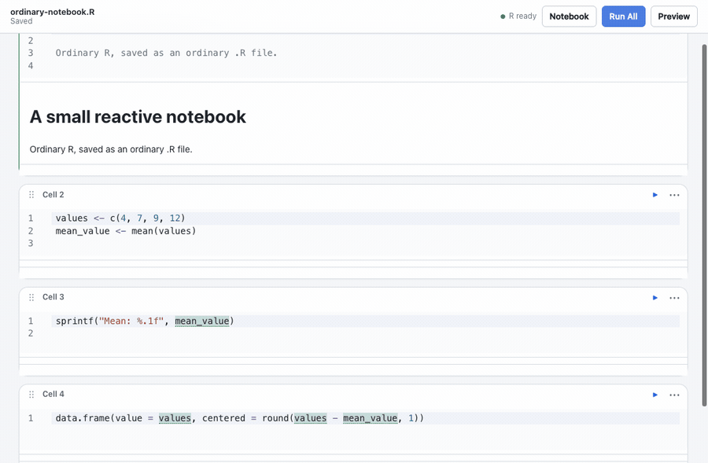
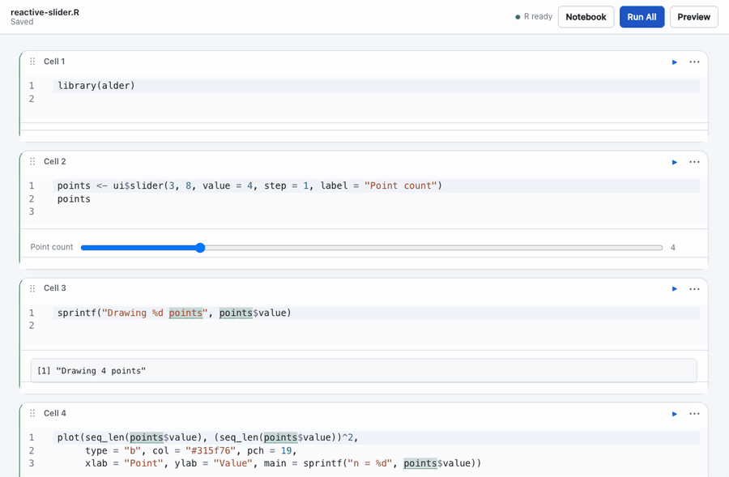
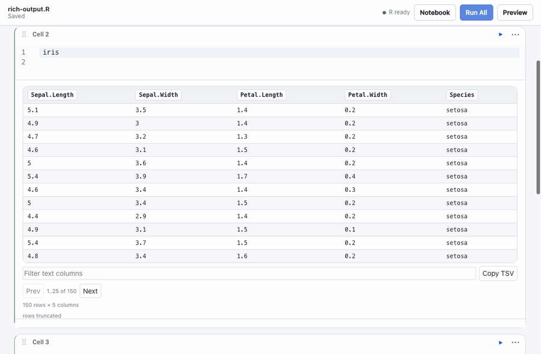

# Alder

Alder is a reactive notebook for R on macOS. It keeps notebooks as ordinary
`.R` files, uses `# %%` comments for cells, and puts editing, results, plots,
tables, and controls in one focused window.



*Open an ordinary `.R` file, run it, and keep the results beside the code.*

## Install

Alder currently requires:

- macOS 13 or later
- R 4.6 or later, including `Rscript`

Copy the provided `Alder.app` bundle to your Applications folder, then open it.
Alder normally finds the system R installation automatically. If the status bar
shows **R unavailable**, choose **R…** and select the `Rscript` executable from
the R installation you want to use.

Choose **File → Open…** or **Open notebook…** to open an existing `.R` file. A
new notebook can be saved anywhere a normal R script can be saved.

## Your first notebook

`# %%` starts a code cell. `# %% [markdown]` starts a Markdown cell whose source
remains valid R comments. Cell options use `#| key: value` lines.

Paste this into a new file and save it as `iris-notebook.R`:

```r
# %% [markdown]
# # Iris, reactively
#
# Move the slider to update the table and plot.

# %%
library(alder)

# %%
minimum_length <- ui$slider(
  4, 7, value = 5, step = 0.1,
  label = "Minimum sepal length"
)
minimum_length

# %%
selected <- subset(iris, Sepal.Length >= minimum_length$value)
selected

# %%
plot(
  selected$Sepal.Length, selected$Sepal.Width,
  col = as.integer(selected$Species), pch = 19,
  xlab = "Sepal length", ylab = "Sepal width"
)
```

Use the triangle on a cell to run it, or **Run All** to run the notebook. The
toolbar shows whether R is ready or running, and **Stop** interrupts the active
work when you need it.

## Reactive results

In automatic mode, Alder tracks ordinary static references between cells and
reruns affected results after an edit or control change. Lazy mode marks affected
cells as stale and lets you decide when to run them.



*Controls are R values. Changing one reruns the results that depend on it.*

Dynamic or opaque references such as generated `eval()` expressions may need an
explicit cell or notebook rerun. A notebook global has one defining cell, and
Alder reports known dependency cycles instead of guessing an execution order.

## Scientific output where you need it

Data frames become pageable, filterable tables; base-R graphics appear inline;
Markdown can introduce and explain an analysis. The bundled `alder` R helpers add
controls, composed rich output, lazy details, progress, and explicit computation
caching without changing the file format.



*Inspect a data frame, then continue directly into its plot.*

The inspector keeps the notebook outline, current variables, and dependency view
nearby. Editor completion, signatures, diagnostics, formatting, package actions,
Preview, and HTML publishing are available from the notebook and application
menus.

## Your work stays an R file

Saving writes the same script you opened. Alder preserves unsaved edits for
recovery and detects changes made by another editor, offering an explicit choice
instead of silently replacing either version. Editing and saving remain available
even when R is unavailable.

The notebook can also be opened through Alder's bundled MCP command when a local
agent needs structured access to the same document and execution session.

## Examples and development

[Iris](inst/examples/iris.R) is a package-free reactive example, and
[demo.R](demo.R) adds a `ggplot2` workflow. Both remain ordinary R scripts.

To build Alder or contribute to the project, start with the
[development guide](dev/README.md). The source is licensed under the
[Apache License 2.0](LICENSE).
