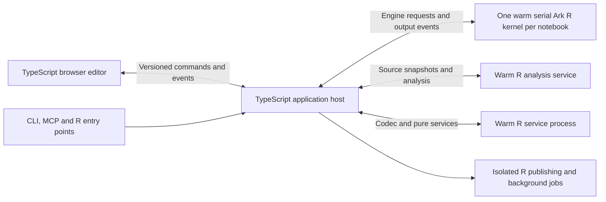

# Responsive notebook architecture and migration

Status: source entry points use the host and Ark; the packaged Linux runtime
passes installed execution, interruption/recovery, CLI and cleanup checks.
The archived runtime and its test harnesses have been removed; tests target the
production host, Ark and the retained pure R APIs. The migrated Linux suites
pass; macOS, Windows and latency release qualification remain pending. 2026-09-07.
The first migration deliverable is the input-to-result benchmark described in
[INPUT-LATENCY.md](reviews/INPUT-LATENCY.md). Earlier ADRs describe the shipping
implementation until their individual replacements land. Historical release
reviews are evidence for their exact artifacts, not acceptance of this target.

## Product requirement

Creating and running a few cells of assignments and arithmetic must feel like
using an already-open R console. Correct visible results, acknowledged source,
and preserved R semantics are the requirement. An early spinner is insufficient.

On a recorded reference machine, after notebook readiness, each scalar execution
scenario must have median input-to-visible-result latency at most 50 ms and p95
at most 100 ms. These are release targets, not claims about today's code. Measure
the single-cell case, a three-cell dependency chain, and the same chain embedded
in 100 unrelated code cells. Measure unchanged Run and immediate edit-and-Run
separately. Collect at least 30 measured repetitions per scenario, after explicit
warm-up; retain every sample, timeout and failure. Record cold CLI readiness,
browser readiness and first execution separately; never bury them in warm-up.
Also measure native cell creation through a visible, usable focused editor.

Execution readiness means internal evaluation/capture machinery is initialized;
users must not run throwaway cells to obtain the fast path. The same latency
targets apply to the first scalar interaction after that readiness signal.
Qualify that separately across fresh sessions; the phase-0 harness retains a
first execution per fixture, which diagnoses this cost but is insufficient to
establish its p95. CLI/browser startup remains a separate measurement.

The browser endpoint is a visible current result after a rendering opportunity,
with the exact source revision and run identity reconciled. A DOM write or a
successful HTTP response alone is insufficient. The current benchmark uses a
two-animation-frame presentation opportunity, explicitly reported as a proxy
for paint rather than a hardware display timestamp. Reference-machine latency
gates are separate from portable correctness tests.
Start timing at the trusted input event's creation timestamp and retain handler
entry separately; a blocked main thread's input delay must not disappear from
the result merely because JavaScript could not start its own timer sooner.

## Ownership and processes

The TypeScript host owns source revisions, notebook structure, the dependency
graph, execution plans, stale-state transitions, operation journals, persistence
coordination, artifact lifetime, browser connections, HTTP and MCP adapters, and
the LSP client. One controller implements operations for every client. The
browser maintains local editing intent and acknowledged revisions; it is not a
second execution authority.

The R package owns R parsing and semantic analysis, the byte-preserving notebook
codec, evaluation, R objects and environments, widget constructors and R-side
validation, condition/graphics capture, object rendering, package/renv work,
and R publishing integrations. Interactive and Session-backed export entry points
call the same host controller. File conversion and analysis helpers stay local.
`alder_source(path, env)` retains its explicit in-process environment semantics,
as does the one-shot `alder_test()` utility: each walks a fixed analyzed plan in
R, with no reactive Session, transport or event loop. Port graph parity tests so
these utilities and the host agree on ordering, disabled descendants and
diagnostics. There must not be a second reactive controller for headless exports.

The Ark kernel retains one notebook environment. Packages, closures,
database connections, external pointers and large data remain in this process.
Messages carry code, identifiers, bounded descriptions and artifact handles,
not snapshots of every R binding. Kernel death invalidates all runtime handles;
retained output bytes remain available with explicit stale status.

Analysis runs outside the evaluating kernel so editing and dependency diagnostics
remain available during a long computation. It analyzes immutable source
snapshots, never evaluates notebook code, and returns revision-tagged results.
The host discards obsolete analysis and cannot dispatch against an unvalidated
source revision. LSP assistance and optional lintr diagnostics are independent
of the required dependency/syntax validation. Codec and other pure service
requests use a separate warm R process, so document conversion cannot occupy
the required analyzer while a Run waits for validation.

The current host uses Node and TypeScript, with shared browser/host types and
runtime schemas. Use maintained MCP and JSON-RPC/LSP libraries, retaining Alder's
stricter limits and lifecycle contracts where library defaults differ. The
implementation language may change if behavior and correctness are preserved;
the same end-to-end latency gates still apply. Ark is a packaged upstream native
dependency, not an Alder-maintained kernel fork.

## Fast execution path

1. Create the local cell/editor immediately with a stable client operation ID;
   reconcile its server identity without replacing a focused editor. Persisted
   source and execution results become authoritative only on acknowledgment.
2. Run sends the requested target plus pending source edits and their revision
   preconditions in one ordered command. Validate every precondition before any
   edit or execution effect. An explicit Run bypasses typing debounce. Automatic
   server completion follows the same 400-ms typing pause as source commits;
   Run cancels pending completion, and explicit Tab completion remains immediate.
   Source conflicts remain conflicts;
   never silently run old or guessed source.
3. Analyze only changed cell bodies. Cache analysis by source and analysis
   policy/version, maintaining symbol ownership indexes. Recompute affected
   edges, duplicate definitions, cycles and descendants, including deletions,
   moves, changed ownership and bounded dynamic/package barriers. Retain the
   last validated graph while body edits await analysis; advance validation
   metadata without rebuilding or resending an unchanged dependency relation.
4. Dispatch immediately to the warm kernel over a persistent connection. Keep
   execution serial and deterministic. Read responses on readiness events;
   do not insert a polling timer or deliberate sleep between cheap cells.
   Small dependency chains use two to four top-level R expressions in one Ark
   request. Each cell checks a revocable host permit before execution; edits
   and Stop revoke it before interruption so obsolete queued source cannot
   produce effects. Independent cells and dynamic barriers stay serial.
   Within a batch, the next native expression boundary completes the preceding
   cell after its task callbacks and output. The final cell and batch settlement
   still wait for the matching native reply, IOPub idle and interrupt delivery.
   Single evaluations cancelled while waiting in the native queue are revoked
   before dispatch and settle explicitly without a started event. Once dispatched,
   ordinary interruption and native terminal settlement still apply.
5. Commit each matching result and push its bounded delta immediately. The
   browser updates only the affected cell/output and renders on the next frame.
   A cell's running projection waits up to 100 ms to avoid flashing during quick
   evaluations; output replaces that pending projection immediately, and runtime
   controls still expose busy state and Stop without this delay.
   Expensive variable inspection, graph layout, help, autosave and reporting
   cannot delay that result. Required validation and output conditions cannot
   be deferred past a successful completion event.

Optional variable snapshots use Ark's native UI RPC on the same bounded serial
queue, avoiding another REPL expression and preserving `.Last.value`. Channel
setup, the matching RPC reply/IOPub idle and settlement hooks complete before
the queue admits another command.

One persistent browser connection carries ordered commands/events. WebSocket is
the target transport; HTTP remains appropriate for immutable assets, downloads
and initial connection setup. Reconnect uses an event cursor and session epoch:
replay retained events when possible, otherwise send one authoritative snapshot.
Full snapshots are for initialization/recovery/explicit inspection, not each
cell completion. Per-client backpressure coalesces superseded state, preserves
ordered logs/terminal events, bounds memory and disconnects unrecoverable clients.

Keep output infrastructure lightweight for nonplotting code. Install reusable
capture machinery once where possible; create graphics artifacts when graphics
occur. Preserve plots produced inside functions and arbitrary packages using
runtime capture, not source-text guesses. Avoid opening a raster device and
creating scratch files for each scalar assignment. Refresh variable metadata
incrementally or on demand; never serialize whole live objects just to refresh
the sidebar. The Variables panel shows runtime bindings, without substituting
unexecuted source definitions while metadata refreshes. Render only changed records; virtualize long notebooks while
preserving editor state, focus, selection, scroll and accessibility navigation.

## Engine contract and correctness

Version the protocol independently of package versions. A handshake advertises
protocol, engine/package identity, supported capabilities and readiness. Reject
incompatible versions visibly before user-code execution. Frame sizes, nesting,
UTF-8, JSON shapes and duplicate-key rules are explicit and tested.
The host admits at most 10,000 cells and 32 MiB of combined cell source before
applying a source transaction. Dependency graphs retain at most 1,000,000 edges;
exceeding that limit keeps source editable and blocks execution with a diagnostic.

Every operation carries session epoch, operation ID and relevant source
revisions; execution adds run ID and cell ID. Each output event carries a
monotonic sequence within its execution. ACK means accepted, started means the
kernel entered that evaluation, and completed means evaluation, required output
capture and cleanup reached a terminal state. Cancellation-requested is a
separate state. A cancelled promise is not proof that R stopped.

Commands cover analysis, run, interrupt, restart, widget operations, inspection,
lazy output/table requests, package jobs and shutdown. Events cover receipts,
diagnostics, cell started/output/conditions/completed, runtime availability and
operation settlement. Widgets and inspections preserve owner/path/revision
identity, exact causal run-button resets and `stale_value` errors. Error payloads
preserve Alder codes and complete bounded conditions. All clients use these
same operations, including MCP calls that wait for exact operation settlement.

Source edits invalidate old/new affected regions. Late results cannot become
current. A late Stop after successful completion commits success. Worker
interrupts are request-scoped and must not hit idle reads or subsequent work.
Recoverable interruption and process termination are different operations on
every platform. Node's Windows signal API is not sufficient by itself; retain
or implement a proven platform adapter and test native Windows recovery.
R RNG, options, search paths, `.libPaths()`, reference semantics and error-side
effects must match the existing documented contracts. No rollback is promised
for arbitrary external or reference-object effects.

The host starts the kernel and analyzer when opening a notebook, before declaring
execution ready. Analysis services use the selected R installation and project
policy; key caches by those identities as well as source. An analyzer failure
keeps source editable, invalidates unconfirmed analysis and exposes recovery;
it never converts missing analysis into permission to execute. Queue/cancel
obsolete analysis requests independently of kernel interrupts. Ordinary editing
and rendering must remain responsive while either R process is busy.

Atomic saves retain same-file/symlink/hard-link and external-edit protections.
Formatting is a revision-checked transaction coordinated with local typing.
Loopback binding, origin checks, CSP, sanitization, artifact paths, resource
limits, source confidentiality and shutdown ownership remain release gates.

## Kernel decision: Ark

Use [Ark](https://github.com/posit-dev/ark), the R kernel used by Positron.
Ark owns the native R frontend, Jupyter execution and output transport,
interruption, graphics and kernel lifecycle. The TypeScript engine adapter maps
Jupyter message identities and terminal states to the controller contract. An
interrupt reply alone is insufficient: settlement must also establish the
matching execution's terminal state and output completion.

Keep the adapter thin. Alder retains notebook-specific R helpers for binding
ownership/cleanup, widgets, cached values and specialized rendering. Reuse Ark's
native capture, graphics, inspection and data-explorer features wherever they
replace Alder code while preserving output bounds, conditions and ownership.
Measure replacements through the complete browser path. Avoid a competing R frontend,
custom kernel framing or platform interrupt supervisor. Required dependency
analysis remains an independent warm R service so it works during evaluation.
Ark's optional language and debugging services can be integrated through its
supported frontend interfaces without changing notebook execution ownership.

Pin and package upstream Ark binaries and their licenses for each platform;
select the user's R installation explicitly. Notebook opening must not download
Ark or compile native dependencies. The earlier mirai prototype confirmed that
its task cancellation resolves before R cleanup and its per-task RNG streams
require extra state handling; it is not the interactive kernel backend.

Independent source analysis, render jobs and explicit user background tasks are
natural pool candidates. They require revision-tagged inputs/results and cannot
mutate the live notebook environment. The first migration does not add automatic
parallel cell semantics or a new public async-cell API.

## Distribution

Ship a versioned application host and built browser assets; end users do not
build JavaScript or install npm dependencies when opening a notebook. Platform
release archives/installers include the supported Node runtime, Ark and required native transport libraries. The R package
locates an explicitly configured or installed compatible host, reports a clear
installation/version error, and never silently downloads executables while
running notebook code. Support the existing CLI and R entry points; preserve
R selection and private/project libraries. CI must validate Linux, macOS and
Windows packages, startup, first/warm execution, interruption and cleanup.
Source-development builds use a pinned Node toolchain and lockfile.

## Component migration inventory

| Current component | Destination and concrete work | Regression coverage |
| --- | --- | --- |
| `R/session.R` | Port the reactive controller to TypeScript: revision transactions, invalidation, execution/run/widget journals, scheduling and freshness. First extract R-specific metadata/rendering calls behind the engine adapter. Keep the existing implementation selectable only during isolated parity tests, then remove it from production. | [test-session.R](../tests/testthat/test-session.R), [controller.test.ts](../host/test/controller.test.ts) |
| `R/analysis.R`, `R/notebook.R` | Retain the R parser, scoping walk and lossless codec. Expose revision-tagged per-cell analysis and file-codec services. Move interactive ownership indexes and incremental graph maintenance to the host. Retain fixed-plan R graph helpers for `alder_source()`/`alder_test()` and compare their results with the host on the same analysis fixtures. | [test-analysis.R](../tests/testthat/test-analysis.R), [test-notebook.R](../tests/testthat/test-notebook.R), [graph.test.ts](../host/test/graph.test.ts), [services.test.ts](../host/test/services.test.ts) |
| `R/worker.R`, `inst/worker/worker.R` | Replace the R process supervisor and 20-ms pipe polling with the host engine adapter. Retain and modularize R evaluation, environments, native output capture and request-scoped interruption. Implement the versioned handshake, framed messages, ordered events and true completion acknowledgments. | [test-ark-bootstrap.R](../tests/testthat/test-ark-bootstrap.R), [engine.test.ts](../host/test/engine.test.ts), [jupyter.test.ts](../host/test/jupyter.test.ts) |
| `R/server.R`, `R/mcp.R`, `R/lsp.R` | Move networking, transport framing, connection lifecycle and dispatch into host libraries. Port origin/CSP/path/error and native LSP URI contracts. Local and URL MCP adapters call the same controller methods and operation journals. | [server-compat.test.ts](../host/test/server-compat.test.ts), [mcp-installed.test.ts](../host/test/mcp-installed.test.ts), [clients.test.ts](../host/test/clients.test.ts) |
| `R/dataflow.R` | Put interactive graph/outline/status projections in the host and update affected records only. Keep R object summarization in the kernel. Preserve the public pure snapshot helpers and test compatibility with the new projections. | [test-dataflow.R](../tests/testthat/test-dataflow.R), [graph.test.ts](../host/test/graph.test.ts), [controller.test.ts](../host/test/controller.test.ts) |
| `inst/app/static/app.js`, `js/src/editor.ts` | Split into typed document, command, event and view modules. Replace state polling with push/recovery, send pending edits with Run, create editors immediately, reconcile changed cells and virtualize offscreen editors. Keep trusted keyboard, focus, scroll, source-conflict and diagnostic behavior. | [test-browser.R](../tests/testthat/test-browser.R), [browser.test.ts](../host/test/browser.test.ts), [clients.test.ts](../host/test/clients.test.ts) |
| `R/outputs.R`, `R/ui-widgets.R`, `R/cache.R` | Keep R APIs, validation, renderers and cached computation semantics. Reuse or lazily initialize capture infrastructure; return bounded metadata/artifact handles. Make one installed widget implementation accessible to the kernel, then remove the byte-mirrored module and its build step once bootstrap parity passes. | [test-widgets.R](../tests/testthat/test-widgets.R), [test-cache.R](../tests/testthat/test-cache.R), [test-host-outputs.R](../tests/testthat/test-host-outputs.R) |
| `R/config.R`, `R/layout.R`, `R/app.R` | Move session configuration, layout persistence and app presentation coordination into the host; preserve the documented R configuration/construction APIs and sidecar formats. Avoid two independently mutating sources of configuration. | [test-config.R](../tests/testthat/test-config.R), [test-layout.R](../tests/testthat/test-layout.R), [test-app.R](../tests/testthat/test-app.R), [controller.test.ts](../host/test/controller.test.ts) |
| `R/packages.R`, `R/format.R`, `R/convert.R`, `R/publish.R`, `R/export.R` | Retain R ecosystem work and pure converters. The host coordinates revision checks, file transactions, jobs and artifacts; Session-backed exports use its controller. Package changes invalidate relevant engine/analysis state. Preserve caller-environment behavior of the fixed-plan source/test utilities. | [test-export-conditions.R](../tests/testthat/test-export-conditions.R), [test-host-services.R](../tests/testthat/test-host-services.R), [jobs.test.ts](../host/test/jobs.test.ts), [host.test.ts](../host/test/host.test.ts) |
| `R/cli.R`, `exec/`, `inst/worker/server.R` | Make R and shell entry points locate the packaged compatible host and selected R. Port exit codes, signals, library/bootstrap settings and shutdown ownership; retire the R HTTP launcher after installed parity. | [test-cli.R](../tests/testthat/test-cli.R), [test-host-launch.R](../tests/testthat/test-host-launch.R), [smoke-release.mjs](../host/scripts/smoke-release.mjs) |
| `tests/testthat/`, `dev/reviews/` | Keep R semantics tests in R; port controller/transport contracts to TypeScript and retain installed browser/API/MCP acceptance. Adapt the latency observer to command/event receipts without moving its trusted-input or visible-result endpoints. Carry forward raw baseline artifacts for comparison. | [browser.test.ts](../host/test/browser.test.ts), [latency-observer.test.ts](../host/test/latency-observer.test.ts), [profile-evidence.test.ts](../host/test/profile-evidence.test.ts) |

Maintain a contract checklist as each component moves: original regression,
new regression, old component removed, and installed evidence. Do not replace
an entire module merely because its filename appears in this inventory: R
semantics and public pure helpers have explicit owners above.

## Migration work and exit criteria

| Phase | Work | Required evidence before cutover |
| --- | --- | --- |
| 0: measurement | Add trusted input-to-result fixtures, latency distributions, opt-in stage traces and CPU profiles. Record current baseline and unmet targets. | Exact results/source/run receipts, all samples retained, negative controls reject old/wrong results and missing traces; clean teardown. |
| 1: contracts and host scaffold | Create TypeScript host/shared-schema packages, version handshake, engine adapter interface, event cursor/snapshot rules and packaged launchers. Specify commands above as executable schemas. | Schema/compatibility tests, no execution before readiness, installed host/R discovery on every platform. |
| 2: complete vertical slice | Implement create/edit/analyze/run/stream/interrupt/recover using one persistent kernel and the new host. Adapt Ark using the same scenarios and remove duplicate kernel machinery. | Correct three-cell flow, immediate edit-and-Run, serial state/RNG, streamed output, late Stop, worker death and restart; benchmark includes all process hops. |
| 3: single controller | Port Session's graph scheduling, invalidation, revision transactions, run/widget journals and value freshness. Extract remaining R-only helpers. | Existing Session, HTTP and MCP contracts through the new controller; no shadow execution of user code. Remove the old production scheduler after parity. |
| 4: services and clients | Move HTTP, MCP and LSP transport to host libraries; make interactive R/CLI and Session-backed export entry points use the host; migrate save/format, config, packages, layout, publishing and artifacts. | Browser/API/MCP agreement, native paths/lint, conflicts, output fidelity, caller-environment source/test semantics, startup/shutdown and platform tests. Delete duplicated local/URL MCP dispatch and settlement logic. |
| 5: latency and long notebooks | Push deltas, incremental analysis/projections, reusable/lazy capture, bounded previews, selective rendering and editor virtualization. Initialize internal machinery before execution readiness without executing notebook source. | Warm median <=50 ms/p95 <=100 ms for every scalar scenario, measured from real input; first-after-readiness interactions meet the same targets across fresh sessions. Unrelated cells do not dominate. Scientific/graphics and trusted browser flows still pass. |
| 6: release | Remove transitional adapters and obsolete production code, revise ADRs/docs, ship host/runtime/R packages and run full installed/cold gates. | Exact artifact identities, all supported platforms, complete correctness/latency gates and no orphan processes. Historical release evidence is not reused as proof for changed artifacts. |

Phases may overlap behind the engine interface, but there is only one execution
owner for a notebook at any time. Differential tests use isolated notebooks and
processes; never evaluate effectful user code twice to compare backends. Existing
regressions are specifications to port, not code to discard merely because the
implementation language changes.

## Measurement rules and references

Measure elapsed durations with monotonic clocks in each process. Correlate by
identifiers; do not subtract unrelated process/browser clock origins. Record
inclusive stage spans, so nested spans must not be added as disjoint costs.
Separate instrumented traces/CPU profiles from latency acceptance; profiler and
observer overhead are not subtracted to manufacture a faster result. Keep
timeouts, missing stage events, wrong results and resource failures fatal.
Performance-budget failure is an explicit outcome even in baseline/report mode.

References checked 2026-09-06: [RAIL response guidance](https://web.dev/articles/rail),
[Node event-loop work](https://nodejs.org/en/learn/asynchronous-work/dont-block-the-event-loop),
[MCP TypeScript SDK](https://github.com/modelcontextprotocol/typescript-sdk),
[LSP/JSON-RPC libraries](https://github.com/microsoft/vscode-languageserver-node),
[mirai daemon configuration](https://mirai.r-lib.org/reference/daemon.html),
[mirai cancellation](https://mirai.r-lib.org/reference/stop_mirai.html),
[Node process signals](https://nodejs.org/api/child_process.html).
